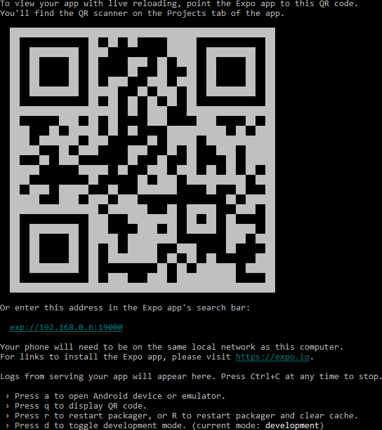

# udaciCards - Flashcards

This is the final assessment project for Udacity's React-Native course (part of the React Nanodegree) where you build a flashcards mobile app using react-native which could be run on both ios and android devices. Users will be able to see a list of their current flashcard decks, add new decks, view individual deck content, add new cards and take quizzes with a score given in percentages at the end. Users will also be able notified through local notification if they have not practiced/taken a quiz by a set time everyday.

This repository includes the code you'll use to start the exp server to run the mobile app leveraging the Expo client app in your Android or iOS devices. There are iOS and Android Simulator options as well provided both environments are installed.

 * [Xcode](https://developer.apple.com/xcode/downloads/)
 * [Android Studio](https://developer.android.com/studio/index.html)

React-Native is used in conjuction with React-Native-Elements to create the views.

Bootstrapped with [create-react-native-app](https://facebook.github.io/react-native/docs/getting-started.html).

### Prerequisites

Running this project requires [Yarn](https://yarnpkg.com/en/docs/install) package manager as the current npm build has some issues running with react-native.

### Tested For iOS

This project is currently tested for *iOS only*. Android testing and support will be performed at a later date.

### Installing and Running *IMPORTANT*

Clone the repo follow the instructions below:

* Install and start project
    - `cd udaciCards`
    - `yarn start`
* Once the expo service is started follow the instructions shown in the console

		

    - To run on your personal iOS or Android Device install the Expo Client App from the app store on any device
    - Open the Client app and use the QR scanner provided by the app or enter the address in the Expo app's search bar most likely in this format: `exp://192.168.0.x:1900x`
    - If you have the XCode or Android environments installed you can also start the app on the emulator following the shortcuts shown on the console

    * [Expo in Android Store](https://play.google.com/store/apps/details?id=host.exp.exponent&hl=en)
    * [Expo in iTunes](https://itunes.apple.com/us/app/expo-client/id982107779?mt=8)

## Built With

* [React-Native](https://facebook.github.io/react-native/)
* [Expo](https://docs.expo.io/versions/latest/index.html)
* [React-Native-Elements](https://react-native-training.github.io/react-native-elements/)
* [React Navigation](https://reactnavigation.org/)

## Resource links

[Redux documentation](http://redux.js.org/)

[Javascript | MDN](https://developer.mozilla.org/en-US/docs/Web/JavaScript/Reference)

[w3schools.com](https://www.w3schools.com)

[expo/vector-icons](https://expo.github.io/vector-icons/)

	* StackOverflow, Google, Medium, Youtube mention *

## License

This project is licensed under the MIT License